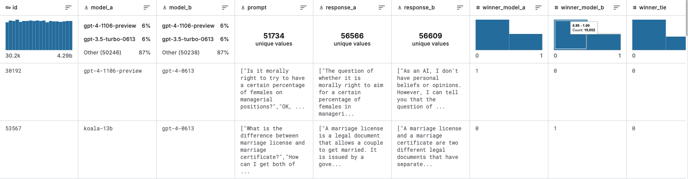
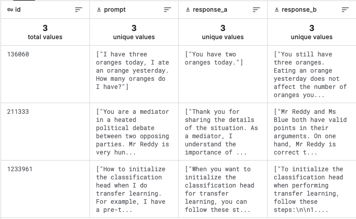
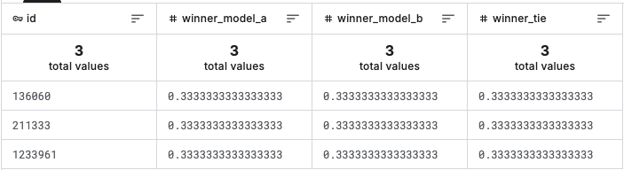

# LLM Classification Finetuning

**Leaderboard score: 0.88017 — rank 16**

> Predicting which of two anonymous LLM responses a human will prefer, by LoRA fine-tuning
> Gemma-2-9b and Llama-3-8b as sequence classifiers on Kaggle TPU, then ensembling them.

## Task

Given a user prompt and two model responses (A and B), predict the probability of three
outcomes: **A wins**, **B wins**, or **tie**. Scored by multi-class log loss, so the
metric rewards *calibrated probabilities*, not just correct picks.

| Split | Size | Notes |
|---|---|---|
| Train | ~57k conversations | Public, with labels |
| Test | hidden | Only 3 placeholder rows are visible in the notebook environment |

Training data — prompts and responses are JSON-encoded lists (multi-turn conversations),
so they need parsing before use:

The visible test file contains just three rows. At submission time Kaggle re-runs the
entire notebook against the full hidden test set, which is why the whole pipeline must
fit inside the 9-hour limit:

## Approach

Two LLMs are LoRA fine-tuned as 3-class sequence classifiers, then combined by a
weighted average.

| | Base model | LoRA target modules | Max length |
|---|---|---|---|
| Model A | `gemma-2-9b-it` | q, k, v, o, gate, up | 1536 |
| Model B | `llama-3-8b` | q, k, v, o, gate, up | 1536 |

### Training — Kaggle TPU v5e-8

- **SPMD sharding** via `torch_xla`, batch split across all 8 chips.
- **bfloat16** throughout; Gemma-2 requires `attn_implementation="eager"` because its
  attention logit soft-capping needs the full score matrix, which fused kernels never
  materialize.
- **1 epoch**, AdamW, LR 5e-5 with cosine decay and 7% warmup.
- LoRA rank 16, alpha 32, dropout 0.05.

### Additional training data

The official ~55k conversations were augmented with **~21k additional labelled
conversations** (the deduplicated release of the community *LMSYS additional 33k*
dataset). The deduplicated version matters: the non-deduplicated file shares 28.8% of
its prompts with the official training set, which would leak into the held-out
validation split and make validation scores look better than they are.

After dropping null responses and holding out 10% for validation:
**51,712 official + 21,184 external ≈ 72,896 training samples.**

## What actually moved the needle

### 1. Sequence length 1024 → 1536

The single largest source of loss was truncation. Measured on the validation split:

| | Truncated | Log loss (not truncated) | Log loss (truncated) |
|---|---|---|---|
| max_length 1024 | 20.6% | 0.87331 | ~1.03 |
| max_length 1536 | 9.6% | 0.87441 | 1.00657 |

Truncated samples score dramatically worse. Going to 2048 was evaluated and rejected —
it would only recover another ~0.006 while blowing past the 9-hour limit.

### 2. Field-wise truncation

The input is `prompt + response_a + response_b` concatenated. Naive right-truncation
removes the tail first, which means **response B gets cut away entirely** on long
samples — the model is then asked to compare two responses having seen only one.

Instead each field gets its own budget: the prompt is capped, and A and B split the
remainder, with the shorter side donating its unused quota to the longer one. Both
responses are always visible. The same function runs at training and inference time so
the text distributions match exactly.

### 3. LoRA on the MLP — and why `down_proj` is excluded

Extending LoRA beyond attention to the MLP helped, but the two MLP projections behave
very differently:

| Module | Symptom when added | Cause |
|---|---|---|
| `gate_proj`, `up_proj` | loss → NaN | No gradient clipping. In bf16 (7-bit mantissa) with LoRA scaling `alpha/rank = 2`, one large gradient overflows to `inf`. Fixed by `clip_grad_norm_(1.0)`. |
| `down_proj` | OOM | It consumes the 14336-dim intermediate activation, 4× wider than the 3584-dim hidden state that gate/up read (which the residual stream already retains). Storing it for all 42 layers costs ~14.8 GB at length 1536. |

So the NaN was a *numerical* problem with a cheap fix, while the OOM was a *memory*
problem that clipping cannot help. Final configuration: six projections, no `down_proj`.

### 4. Position debiasing without doubling the compute

These models are sensitive to presentation order — asked the same question with A and B
swapped, the predicted P(A wins) differs by ~0.08 on average.

The usual fix is to duplicate every sample in both orders, but that doubles the step
count, which did not fit in the TPU budget alongside the extra data and longer
sequences. Instead **50% of samples are swapped in place** (responses and labels
together). The model still sees a symmetric distribution of orderings, the tie ratio is
untouched, and the step count is unchanged.

### 5. Test-time augmentation

At inference each sample is scored twice — original order and swapped — and the two
predictions are averaged. This makes the output exactly order-invariant by construction.
Arithmetic averaging beat geometric averaging (0.88711 vs 0.88770), so arithmetic is used.

### 6. Token-budget batching

Inference runs 8-bit quantized on 2× T4. A fixed batch size has to be chosen for the
*longest* sequence, but token lengths average 660 against a 1536 ceiling — so most
batches used only 43% of the GPU. Replacing fixed batch size with a fixed **token
budget** (long sequences → small batches, short sequences → large ones) raised
utilization to ~93% and roughly halved the number of batches, with identical predictions.

## Results

Validation split (5,746 samples held out from training, seed 2024):

| Model | No TTA | With TTA |
|---|---|---|
| Gemma-2-9b | 0.89712 | **0.88711** |
| Llama-3-8b | 0.91470 | **0.90363** |
| Ensemble (0.75 / 0.25) | — | **~0.8841** |

The weight was swept on the validation split: 0.88429 at w=0.70, best 0.88405 at
w=0.77. The curve is flat across 0.65–0.80, so a round 0.75 was used rather than the
search-derived optimum.

**Leaderboard: 0.88017 (rank 16).**

The submitted ensemble uses three forward passes — Gemma with TTA plus Llama in original
order only. The four-pass version scored marginally better on validation (0.88359 vs
0.88405) but did not fit in the 9-hour limit; trading 0.0007 for a submission that
reliably completes was the better deal.

## Repository

| File | Purpose |
|---|---|
| `gemma-2-9b-fine-tuning.ipynb` | LoRA fine-tuning of Gemma-2-9b on TPU v5e-8 |
| `llama-3-8b-fine-tuning.ipynb` | LoRA fine-tuning of Llama-3-8b on TPU v5e-8 |
| `data/` | Dataset and leaderboard screenshots used in this README |

Training data and model weights are not included — the datasets belong to Kaggle and
their respective publishers, and the LoRA checkpoints are reproducible from the notebooks.

